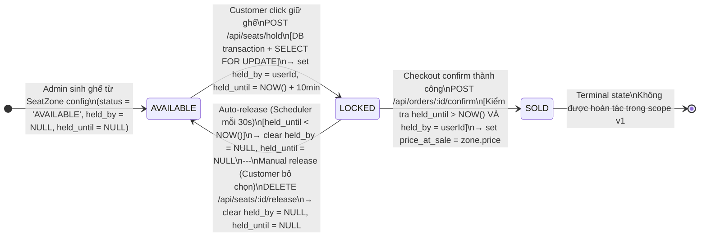
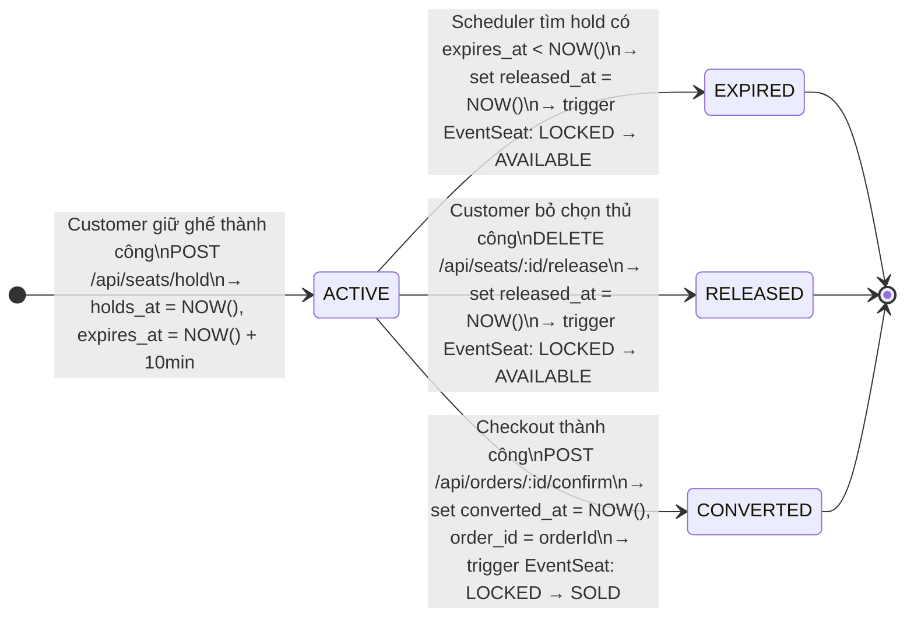
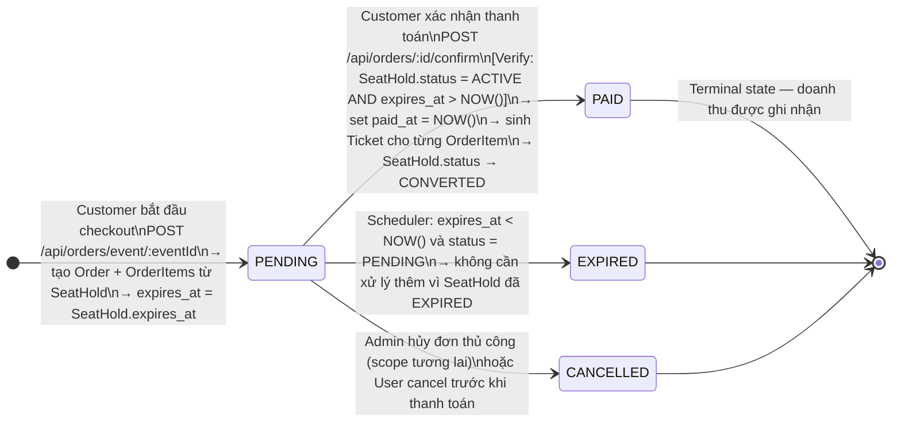
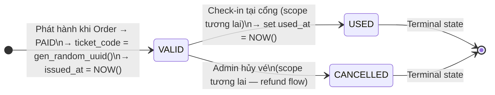
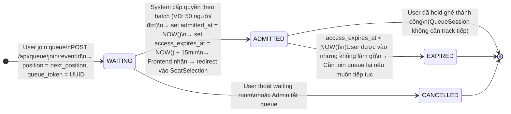
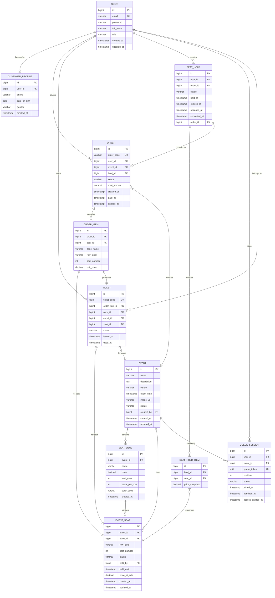

# TicketRush — Data Model Specification

> **Phiên bản:** 1.0  
> **Stack:** Spring Boot 4.0.5 / Java 21 / PostgreSQL / Spring Data JPA  
> **Nguồn sự thật:** Tài liệu phân tích nghiệp vụ + `user-flows.md`

---

## 1. Tổng quan nhóm entity

Hệ thống chia thành **6 nhóm entity** theo miền nghiệp vụ:

| Nhóm | Entities | Mục đích |
|---|---|---|
| **Identity** | `User`, `CustomerProfile` | Xác thực, phân quyền, lưu hồ sơ khách hàng |
| **Event Catalog** | `Event`, `SeatZone` | Thông tin sự kiện và cấu hình khu vực ghế |
| **Seat Inventory** | `EventSeat`, `SeatHold`, `SeatHoldItem` | Quản lý tồn kho ghế theo thời gian thực |
| **Commerce** | `Order`, `OrderItem` | Vòng đời đơn hàng và checkout |
| **Ticket** | `Ticket` | Vé điện tử sau khi thanh toán thành công |
| **Queue** | `QueueSession` | Hàng chờ ảo khi hệ thống quá tải |

---

## 2. Mô tả chi tiết từng Entity

---

## User

- **Purpose:** Lưu thông tin xác thực và phân quyền. Là entity trung tâm của toàn hệ thống. Cả Customer và Admin đều dùng chung bảng này, phân biệt qua trường `role`.

- **Fields:**

  | field_name | Type | Required | Unique | Nullable | Default | Description |
  |---|---|---|---|---|---|---|
  | `id` | BIGSERIAL (PK) | ✅ | ✅ | ❌ | auto | Khóa chính |
  | `email` | VARCHAR(255) | ✅ | ✅ | ❌ | — | Địa chỉ email, dùng làm username |
  | `password` | VARCHAR(255) | ✅ | ❌ | ❌ | — | Mật khẩu đã hash BCrypt |
  | `full_name` | VARCHAR(255) | ✅ | ❌ | ❌ | — | Họ và tên đầy đủ |
  | `role` | VARCHAR(20) | ✅ | ❌ | ❌ | `CUSTOMER` | Enum: `CUSTOMER`, `ADMIN` |
  | `created_at` | TIMESTAMP | ✅ | ❌ | ❌ | `NOW()` | Thời điểm tạo tài khoản |
  | `updated_at` | TIMESTAMP | ✅ | ❌ | ❌ | `NOW()` | Thời điểm cập nhật gần nhất |

- **Relationships:**
  - `User` 1 — 1 `CustomerProfile` (chỉ với role=CUSTOMER)
  - `User` 1 — N `Order`
  - `User` 1 — N `Ticket`
  - `User` 1 — N `SeatHold`
  - `User` 1 — N `QueueSession`

- **Indexes / Constraints:**
  - `UNIQUE(email)`
  - `INDEX(role)` — để query riêng ADMIN/CUSTOMER
  - `CHECK(role IN ('CUSTOMER', 'ADMIN'))`

- **Notes:**
  - Mật khẩu phải được hash trước khi lưu; không bao giờ lưu plain text.
  - Field `role` quyết định quyền truy cập trong Spring Security.
  - Admin được tạo thủ công qua `data.sql` hoặc seed script; không có luồng đăng ký Admin từ UI.

---

## CustomerProfile

- **Purpose:** Lưu thông tin bổ sung của Customer phục vụ analytics (tuổi, giới tính). Tách ra entity riêng để giữ `User` gọn, và vì Admin không cần profile này.

- **Fields:**

  | field_name | Type | Required | Unique | Nullable | Default | Description |
  |---|---|---|---|---|---|---|
  | `id` | BIGSERIAL (PK) | ✅ | ✅ | ❌ | auto | Khóa chính |
  | `user_id` | BIGINT (FK) | ✅ | ✅ | ❌ | — | FK → `users.id`, 1-1 |
  | `phone` | VARCHAR(20) | ✅ | ❌ | ❌ | — | Số điện thoại |
  | `date_of_birth` | DATE | ✅ | ❌ | ❌ | — | Ngày sinh — **bắt buộc** để tính analytics tuổi |
  | `gender` | VARCHAR(10) | ✅ | ❌ | ❌ | — | Enum: `MALE`, `FEMALE`, `OTHER` — **bắt buộc** để tính analytics giới tính |
  | `created_at` | TIMESTAMP | ✅ | ❌ | ❌ | `NOW()` | — |

- **Relationships:**
  - `CustomerProfile` N — 1 `User` (FK: `user_id`)

- **Indexes / Constraints:**
  - `UNIQUE(user_id)` — quan hệ 1-1 với User
  - `INDEX(date_of_birth)` — phục vụ query analytics theo nhóm tuổi
  - `INDEX(gender)` — phục vụ query analytics theo giới tính
  - `CHECK(gender IN ('MALE', 'FEMALE', 'OTHER'))`

- **Notes:**
  - `date_of_birth` và `gender` là **bắt buộc về nghiệp vụ** (xem BR-09 trong `user-flows.md`). Nếu thiếu, dashboard analytics sẽ không đủ dữ liệu.
  - Profile được tạo cùng lúc với User trong transaction của API `POST /api/auth/register`.

---

## Event

- **Purpose:** Lưu thông tin sự kiện do Admin tạo và quản lý. Là entity trung tâm của domain Event Catalog.

- **Fields:**

  | field_name | Type | Required | Unique | Nullable | Default | Description |
  |---|---|---|---|---|---|---|
  | `id` | BIGSERIAL (PK) | ✅ | ✅ | ❌ | auto | Khóa chính |
  | `name` | VARCHAR(500) | ✅ | ❌ | ❌ | — | Tên sự kiện |
  | `description` | TEXT | ❌ | ❌ | ✅ | NULL | Mô tả chi tiết sự kiện |
  | `venue` | VARCHAR(500) | ✅ | ❌ | ❌ | — | Địa điểm tổ chức |
  | `event_date` | TIMESTAMP | ✅ | ❌ | ❌ | — | Ngày và giờ diễn ra |
  | `image_url` | VARCHAR(1000) | ❌ | ❌ | ✅ | NULL | URL ảnh banner sự kiện |
  | `status` | VARCHAR(20) | ✅ | ❌ | ❌ | `UPCOMING` | Enum: `UPCOMING`, `ON_SALE`, `ENDED`, `CANCELLED` |
  | `created_by` | BIGINT (FK) | ✅ | ❌ | ❌ | — | FK → `users.id` (Admin tạo) |
  | `created_at` | TIMESTAMP | ✅ | ❌ | ❌ | `NOW()` | — |
  | `updated_at` | TIMESTAMP | ✅ | ❌ | ❌ | `NOW()` | — |

- **Relationships:**
  - `Event` 1 — N `SeatZone`
  - `Event` 1 — N `EventSeat`
  - `Event` 1 — N `Order`
  - `Event` 1 — N `QueueSession`

- **Indexes / Constraints:**
  - `INDEX(status)` — query danh sách ON_SALE events
  - `INDEX(event_date)` — sắp xếp theo ngày
  - `INDEX(created_by)` — query events của admin
  - `CHECK(status IN ('UPCOMING', 'ON_SALE', 'ENDED', 'CANCELLED'))`

- **Status transitions hợp lệ:**
  ```
  UPCOMING → ON_SALE     (Admin publish)
  ON_SALE  → ENDED       (Admin kết thúc)
  UPCOMING → CANCELLED   (Admin hủy)
  ON_SALE  → CANCELLED   (Admin hủy)
  ```

- **Notes:**
  - Chỉ event có status `ON_SALE` mới hiển thị nút "Chọn ghế" cho Customer.
  - Không được phép xóa Event; chỉ thay đổi status.
  - Khi status chuyển sang `CANCELLED`, cần xem xét xử lý các ghế đang `LOCKED` (ngoài scope v1).

---

## SeatZone

- **Purpose:** Định nghĩa các khu vực ghế trong một sự kiện (VD: VIP, Standard, Economy). Giá vé gắn theo Zone, không phải từng ghế riêng lẻ (BR-11).

- **Fields:**

  | field_name | Type | Required | Unique | Nullable | Default | Description |
  |---|---|---|---|---|---|---|
  | `id` | BIGSERIAL (PK) | ✅ | ✅ | ❌ | auto | Khóa chính |
  | `event_id` | BIGINT (FK) | ✅ | ❌ | ❌ | — | FK → `events.id` |
  | `name` | VARCHAR(100) | ✅ | ❌ | ❌ | — | Tên zone (VD: "Khu A - VIP") |
  | `price` | DECIMAL(15,2) | ✅ | ❌ | ❌ | — | Giá vé cho toàn zone (VND) |
  | `total_rows` | INT | ✅ | ❌ | ❌ | — | Số hàng ghế |
  | `seats_per_row` | INT | ✅ | ❌ | ❌ | — | Số ghế mỗi hàng |
  | `color_code` | VARCHAR(7) | ❌ | ❌ | ✅ | NULL | Màu hiển thị trên seat map (hex) |
  | `created_at` | TIMESTAMP | ✅ | ❌ | ❌ | `NOW()` | — |

- **Relationships:**
  - `SeatZone` N — 1 `Event` (FK: `event_id`)
  - `SeatZone` 1 — N `EventSeat`

- **Indexes / Constraints:**
  - `INDEX(event_id)`
  - `CHECK(price > 0)`
  - `CHECK(total_rows > 0)`
  - `CHECK(seats_per_row > 0)`

- **Notes:**
  - `total_seats = total_rows × seats_per_row` — backend tự tính khi sinh `EventSeat`.
  - Khi Admin lưu cấu hình zone, backend sinh tự động tất cả `EventSeat` records với status `AVAILABLE`.
  - Zone name phải unique trong cùng một event (enforce ở application layer).

---

## EventSeat

- **Purpose:** Đại diện cho từng ghế cụ thể trong một sự kiện. Đây là **đơn vị bán hàng cơ bản** của hệ thống — không phải vé, không phải zone, mà là từng ghế riêng lẻ.

- **Fields:**

  | field_name | Type | Required | Unique | Nullable | Default | Description |
  |---|---|---|---|---|---|---|
  | `id` | BIGSERIAL (PK) | ✅ | ✅ | ❌ | auto | Khóa chính |
  | `event_id` | BIGINT (FK) | ✅ | ❌ | ❌ | — | FK → `events.id` |
  | `zone_id` | BIGINT (FK) | ✅ | ❌ | ❌ | — | FK → `seat_zones.id` |
  | `row_label` | VARCHAR(10) | ✅ | ❌ | ❌ | — | Nhãn hàng (VD: "A", "B", "C") |
  | `seat_number` | INT | ✅ | ❌ | ❌ | — | Số ghế trong hàng (VD: 1, 2, 3) |
  | `status` | VARCHAR(20) | ✅ | ❌ | ❌ | `AVAILABLE` | Enum: `AVAILABLE`, `LOCKED`, `SOLD` |
  | `held_by` | BIGINT (FK) | ❌ | ❌ | ✅ | NULL | FK → `users.id` — user đang giữ ghế |
  | `held_until` | TIMESTAMP | ❌ | ❌ | ✅ | NULL | Thời điểm hết hạn hold |
  | `price_at_sale` | DECIMAL(15,2) | ❌ | ❌ | ✅ | NULL | Giá lúc bán (snapshot từ zone.price) |
  | `created_at` | TIMESTAMP | ✅ | ❌ | ❌ | `NOW()` | — |
  | `updated_at` | TIMESTAMP | ✅ | ❌ | ❌ | `NOW()` | — |

- **Relationships:**
  - `EventSeat` N — 1 `Event` (FK: `event_id`)
  | `EventSeat` N — 1 `SeatZone` (FK: `zone_id`)
  - `EventSeat` N — 1 `User` (FK: `held_by`, nullable)
  - `EventSeat` 1 — 1 `OrderItem` (khi SOLD)
  - `EventSeat` 1 — 1 `Ticket` (khi SOLD)

- **Indexes / Constraints:**
  - `UNIQUE(event_id, zone_id, row_label, seat_number)` — không cho phép ghế trùng
  - `INDEX(event_id, status)` — query seat map theo event + filter status
  - `INDEX(held_by)` — query ghế đang giữ của một user
  - `INDEX(held_until)` — Scheduler dùng để tìm ghế hết hạn
  - `CHECK(status IN ('AVAILABLE', 'LOCKED', 'SOLD'))`

- **Notes:**
  - `price_at_sale` lưu giá tại thời điểm SOLD để tránh thay đổi giá zone ảnh hưởng lịch sử.
  - Khi hold: `status → LOCKED`, set `held_by`, `held_until`.
  - Khi release: `status → AVAILABLE`, clear `held_by = NULL`, `held_until = NULL`.
  - Khi sold: `status → SOLD`, giữ `held_by` làm lịch sử.
  - **Row-level locking:** `SELECT ... FOR UPDATE` trên ghế trước khi cập nhật (xem Concurrency Notes).

---

## SeatHold

- **Purpose:** Lưu lịch sử các lần giữ ghế. Tách khỏi `EventSeat` để có audit trail và tránh mất dữ liệu khi ghế bị release. Một SeatHold có thể chứa nhiều ghế (tối đa 2).

- **Fields:**

  | field_name | Type | Required | Unique | Nullable | Default | Description |
  |---|---|---|---|---|---|---|
  | `id` | BIGSERIAL (PK) | ✅ | ✅ | ❌ | auto | Khóa chính |
  | `user_id` | BIGINT (FK) | ✅ | ❌ | ❌ | — | FK → `users.id` |
  | `event_id` | BIGINT (FK) | ✅ | ❌ | ❌ | — | FK → `events.id` |
  | `status` | VARCHAR(20) | ✅ | ❌ | ❌ | `ACTIVE` | Enum: `ACTIVE`, `EXPIRED`, `RELEASED`, `CONVERTED` |
  | `held_at` | TIMESTAMP | ✅ | ❌ | ❌ | `NOW()` | Thời điểm bắt đầu hold |
  | `expires_at` | TIMESTAMP | ✅ | ❌ | ❌ | — | `held_at + 10 phút` |
  | `released_at` | TIMESTAMP | ❌ | ❌ | ✅ | NULL | Thời điểm release (thủ công hoặc auto) |
  | `converted_at` | TIMESTAMP | ❌ | ❌ | ✅ | NULL | Thời điểm checkout thành công |
  | `order_id` | BIGINT (FK) | ❌ | ❌ | ✅ | NULL | FK → `orders.id` (khi CONVERTED) |

- **Relationships:**
  - `SeatHold` N — 1 `User` (FK: `user_id`)
  - `SeatHold` N — 1 `Event` (FK: `event_id`)
  - `SeatHold` 1 — N `SeatHoldItem`
  - `SeatHold` N — 1 `Order` (FK: `order_id`, nullable)

- **Indexes / Constraints:**
  - `INDEX(user_id, event_id, status)` — tìm hold active của user cho event
  - `INDEX(expires_at, status)` — Scheduler tìm hold hết hạn
  - `CHECK(status IN ('ACTIVE', 'EXPIRED', 'RELEASED', 'CONVERTED'))`
  - `CHECK(expires_at > held_at)`

- **Notes:**
  - Một user chỉ được có một SeatHold `ACTIVE` cho mỗi event tại một thời điểm.
  - `CONVERTED` = checkout thành công, `RELEASED` = user bỏ chọn thủ công, `EXPIRED` = hết 10 phút.

---

## SeatHoldItem

- **Purpose:** Chi tiết từng ghế trong một SeatHold. Cho phép hold nhiều ghế (tối đa 2) trong cùng một session.

- **Fields:**

  | field_name | Type | Required | Unique | Nullable | Default | Description |
  |---|---|---|---|---|---|---|
  | `id` | BIGSERIAL (PK) | ✅ | ✅ | ❌ | auto | Khóa chính |
  | `hold_id` | BIGINT (FK) | ✅ | ❌ | ❌ | — | FK → `seat_holds.id` |
  | `seat_id` | BIGINT (FK) | ✅ | ❌ | ❌ | — | FK → `event_seats.id` |
  | `price_snapshot` | DECIMAL(15,2) | ✅ | ❌ | ❌ | — | Giá zone tại thời điểm hold |

- **Relationships:**
  - `SeatHoldItem` N — 1 `SeatHold` (FK: `hold_id`)
  - `SeatHoldItem` N — 1 `EventSeat` (FK: `seat_id`)

- **Indexes / Constraints:**
  - `UNIQUE(hold_id, seat_id)` — mỗi ghế chỉ xuất hiện một lần trong một hold
  - `INDEX(seat_id)` — kiểm tra ghế đang nằm trong hold nào

---

## Order

- **Purpose:** Đại diện cho một đơn hàng (checkout session). Được tạo khi user bắt đầu checkout, chuyển sang PAID khi xác nhận thành công.

- **Fields:**

  | field_name | Type | Required | Unique | Nullable | Default | Description |
  |---|---|---|---|---|---|---|
  | `id` | BIGSERIAL (PK) | ✅ | ✅ | ❌ | auto | Khóa chính |
  | `order_code` | VARCHAR(50) | ✅ | ✅ | ❌ | generated | Mã đơn hàng hiển thị cho user (VD: TKR-20260501-0001) |
  | `user_id` | BIGINT (FK) | ✅ | ❌ | ❌ | — | FK → `users.id` |
  | `event_id` | BIGINT (FK) | ✅ | ❌ | ❌ | — | FK → `events.id` |
  | `hold_id` | BIGINT (FK) | ✅ | ❌ | ❌ | — | FK → `seat_holds.id` |
  | `status` | VARCHAR(20) | ✅ | ❌ | ❌ | `PENDING` | Enum: `PENDING`, `PAID`, `EXPIRED`, `CANCELLED` |
  | `total_amount` | DECIMAL(15,2) | ✅ | ❌ | ❌ | — | Tổng tiền đơn hàng |
  | `created_at` | TIMESTAMP | ✅ | ❌ | ❌ | `NOW()` | — |
  | `paid_at` | TIMESTAMP | ❌ | ❌ | ✅ | NULL | Thời điểm thanh toán thành công |
  | `expires_at` | TIMESTAMP | ✅ | ❌ | ❌ | — | `created_at + 10 phút` (khớp với SeatHold) |

- **Relationships:**
  - `Order` N — 1 `User` (FK: `user_id`)
  - `Order` N — 1 `Event` (FK: `event_id`)
  - `Order` 1 — 1 `SeatHold` (FK: `hold_id`)
  - `Order` 1 — N `OrderItem`

- **Indexes / Constraints:**
  - `UNIQUE(order_code)`
  - `INDEX(user_id, status)` — query orders của user
  - `INDEX(event_id, status)` — admin query orders theo event
  - `INDEX(status, expires_at)` — tìm PENDING orders hết hạn
  - `CHECK(status IN ('PENDING', 'PAID', 'EXPIRED', 'CANCELLED'))`
  - `CHECK(total_amount >= 0)`

- **Notes:**
  - Order chỉ có thể được PAID nếu `SeatHold` vẫn còn `ACTIVE` và `expires_at > NOW()`.
  - Dashboard doanh thu chỉ tính Orders có status = `PAID`.

---

## OrderItem

- **Purpose:** Chi tiết từng ghế trong một đơn hàng. Lưu snapshot giá để đảm bảo tính bất biến của lịch sử giao dịch.

- **Fields:**

  | field_name | Type | Required | Unique | Nullable | Default | Description |
  |---|---|---|---|---|---|---|
  | `id` | BIGSERIAL (PK) | ✅ | ✅ | ❌ | auto | Khóa chính |
  | `order_id` | BIGINT (FK) | ✅ | ❌ | ❌ | — | FK → `orders.id` |
  | `seat_id` | BIGINT (FK) | ✅ | ✅ | ❌ | — | FK → `event_seats.id` — UNIQUE: mỗi ghế chỉ bán 1 lần |
  | `zone_name` | VARCHAR(100) | ✅ | ❌ | ❌ | — | Tên zone tại thời điểm bán (snapshot) |
  | `row_label` | VARCHAR(10) | ✅ | ❌ | ❌ | — | Hàng ghế (snapshot) |
  | `seat_number` | INT | ✅ | ❌ | ❌ | — | Số ghế (snapshot) |
  | `unit_price` | DECIMAL(15,2) | ✅ | ❌ | ❌ | — | Giá đơn vị tại thời điểm bán |

- **Relationships:**
  - `OrderItem` N — 1 `Order` (FK: `order_id`)
  - `OrderItem` 1 — 1 `EventSeat` (FK: `seat_id`)
  - `OrderItem` 1 — 1 `Ticket`

- **Indexes / Constraints:**
  - `UNIQUE(seat_id)` — **constraint quan trọng nhất**: đảm bảo một ghế chỉ được bán một lần duy nhất
  - `INDEX(order_id)`

- **Notes:**
  - Snapshot `zone_name`, `row_label`, `seat_number` để lịch sử đơn hàng không thay đổi kể cả khi zone được rename.

---

## Ticket

- **Purpose:** Vé điện tử được phát hành sau khi Order được PAID. Mỗi ghế tương ứng với một Ticket. Ticket chứa UUID duy nhất dùng làm QR code.

- **Fields:**

  | field_name | Type | Required | Unique | Nullable | Default | Description |
  |---|---|---|---|---|---|---|
  | `id` | BIGSERIAL (PK) | ✅ | ✅ | ❌ | auto | Khóa chính |
  | `ticket_code` | UUID | ✅ | ✅ | ❌ | `gen_random_uuid()` | Mã vé duy nhất — **dữ liệu QR code** |
  | `order_item_id` | BIGINT (FK) | ✅ | ✅ | ❌ | — | FK → `order_items.id` (1-1) |
  | `user_id` | BIGINT (FK) | ✅ | ❌ | ❌ | — | FK → `users.id` (denormalized, tiện query) |
  | `event_id` | BIGINT (FK) | ✅ | ❌ | ❌ | — | FK → `events.id` (denormalized) |
  | `seat_id` | BIGINT (FK) | ✅ | ✅ | ❌ | — | FK → `event_seats.id` (1-1) |
  | `status` | VARCHAR(20) | ✅ | ❌ | ❌ | `VALID` | Enum: `VALID`, `USED`, `CANCELLED` |
  | `issued_at` | TIMESTAMP | ✅ | ❌ | ❌ | `NOW()` | Thời điểm phát hành vé |
  | `used_at` | TIMESTAMP | ❌ | ❌ | ✅ | NULL | Thời điểm check-in (scope tương lai) |

- **Relationships:**
  - `Ticket` 1 — 1 `OrderItem` (FK: `order_item_id`)
  - `Ticket` N — 1 `User` (FK: `user_id`)
  - `Ticket` N — 1 `Event` (FK: `event_id`)
  - `Ticket` 1 — 1 `EventSeat` (FK: `seat_id`)

- **Indexes / Constraints:**
  - `UNIQUE(ticket_code)` — UUID phải duy nhất toàn hệ thống
  - `UNIQUE(order_item_id)` — 1 order item = 1 ticket
  - `UNIQUE(seat_id)` — 1 ghế = 1 ticket (tại mỗi thời điểm)
  - `INDEX(user_id, status)` — query "vé của tôi"
  - `INDEX(event_id)` — admin query tickets theo event
  - `CHECK(status IN ('VALID', 'USED', 'CANCELLED'))`

- **Notes:**
  - `ticket_code` (UUID) là **nội dung được encode thành QR Code** trên frontend, không phải ảnh ngẫu nhiên (BR-10 trong user-flows).
  - Scope hiện tại: chỉ phát hành và hiển thị QR. Check-in scan QR là scope tương lai.

---

## QueueSession

- **Purpose:** Quản lý hàng chờ ảo khi sự kiện có traffic cao. Mỗi user nhận một QueueSession với vị trí và token truy cập.

- **Fields:**

  | field_name | Type | Required | Unique | Nullable | Default | Description |
  |---|---|---|---|---|---|---|
  | `id` | BIGSERIAL (PK) | ✅ | ✅ | ❌ | auto | Khóa chính |
  | `user_id` | BIGINT (FK) | ✅ | ❌ | ❌ | — | FK → `users.id` |
  | `event_id` | BIGINT (FK) | ✅ | ❌ | ❌ | — | FK → `events.id` |
  | `queue_token` | UUID | ✅ | ✅ | ❌ | `gen_random_uuid()` | Token định danh phiên chờ |
  | `position` | INT | ✅ | ❌ | ❌ | — | Vị trí trong hàng đợi |
  | `status` | VARCHAR(20) | ✅ | ❌ | ❌ | `WAITING` | Enum: `WAITING`, `ADMITTED`, `CANCELLED`, `EXPIRED` |
  | `joined_at` | TIMESTAMP | ✅ | ❌ | ❌ | `NOW()` | Thời điểm vào hàng chờ |
  | `admitted_at` | TIMESTAMP | ❌ | ❌ | ✅ | NULL | Thời điểm được vào |
  | `access_expires_at` | TIMESTAMP | ❌ | ❌ | ✅ | NULL | Token hết hạn sau khi ADMITTED (VD: 15 phút) |

- **Relationships:**
  - `QueueSession` N — 1 `User` (FK: `user_id`)
  - `QueueSession` N — 1 `Event` (FK: `event_id`)

- **Indexes / Constraints:**
  - `UNIQUE(queue_token)`
  - `UNIQUE(user_id, event_id, status)` khi `status = 'WAITING'` — một user chỉ có một slot chờ active
  - `INDEX(event_id, status, position)` — query hàng chờ theo thứ tự
  - `INDEX(status, access_expires_at)` — tìm ADMITTED sessions hết hạn
  - `CHECK(status IN ('WAITING', 'ADMITTED', 'CANCELLED', 'EXPIRED'))`
  - `CHECK(position > 0)`

---

## 3. State Transitions

---

### A. EventSeat — Seat Status Lifecycle



**Điều kiện chuyển trạng thái:**

| Transition | Điều kiện bắt buộc | Action phụ |
|---|---|---|
| `AVAILABLE → LOCKED` | Status = AVAILABLE; DB transaction; SELECT FOR UPDATE | Set `held_by`, `held_until`; Broadcast WS |
| `LOCKED → AVAILABLE` | `held_until < NOW()` (auto) HOẶC user là owner (manual) | Clear `held_by = NULL`, `held_until = NULL`; Broadcast WS |
| `LOCKED → SOLD` | Status = LOCKED; `held_by = userId`; `held_until > NOW()` | Set `price_at_sale`; Tạo OrderItem, Ticket; Broadcast WS |
| `SOLD → *` | **Không hợp lệ** — SOLD là terminal state | — |

---

### B. SeatHold — Hold Lifecycle



**Invariant:** Mỗi user chỉ có tối đa **một** SeatHold với status `ACTIVE` cho mỗi event tại một thời điểm.

---

### C. Order — Order Lifecycle



**Lưu ý:** `Order.expires_at` phải khớp với `SeatHold.expires_at` để đảm bảo consistency.

---

### D. Ticket — Ticket Lifecycle



**Scope hiện tại (v1):** Chỉ implement `VALID`. Các chuyển trạng thái sang `USED` và `CANCELLED` là scope tương lai.

---

### E. QueueSession — Queue Lifecycle



**Invariant:** Một user chỉ có một QueueSession với status `WAITING` cho mỗi event.

---

## 4. Relationship Diagram (ERD)



---

### Bảng tóm tắt quan hệ

| From | Cardinality | To | FK Column | Ghi chú |
|---|---|---|---|---|
| `User` | 1—1 | `CustomerProfile` | `customer_profiles.user_id` | Chỉ với CUSTOMER role |
| `User` | 1—N | `Order` | `orders.user_id` | — |
| `User` | 1—N | `Ticket` | `tickets.user_id` | Denormalized |
| `User` | 1—N | `SeatHold` | `seat_holds.user_id` | — |
| `User` | 1—N | `QueueSession` | `queue_sessions.user_id` | — |
| `Event` | 1—N | `SeatZone` | `seat_zones.event_id` | — |
| `Event` | 1—N | `EventSeat` | `event_seats.event_id` | — |
| `Event` | 1—N | `Order` | `orders.event_id` | — |
| `Event` | 1—N | `QueueSession` | `queue_sessions.event_id` | — |
| `SeatZone` | 1—N | `EventSeat` | `event_seats.zone_id` | — |
| `SeatHold` | 1—N | `SeatHoldItem` | `seat_hold_items.hold_id` | Tối đa 2 items |
| `SeatHold` | 1—1 | `Order` | `seat_holds.order_id` | Nullable until CONVERTED |
| `Order` | 1—N | `OrderItem` | `order_items.order_id` | — |
| `OrderItem` | 1—1 | `EventSeat` | `order_items.seat_id` | UNIQUE constraint |
| `OrderItem` | 1—1 | `Ticket` | `tickets.order_item_id` | UNIQUE constraint |

---

## 5. Concurrency Notes

### 5.1 Hold ghế — Race Condition Prevention

**Vấn đề:** Nếu 2 user cùng click ghế VIP-A1 gần như đồng thời, không có cơ chế locking thì cả 2 đều có thể hold thành công → bán trùng ghế.

**Giải pháp bắt buộc:**

```sql
-- Trong một transaction:
BEGIN;

-- 1. Lock hàng ghế trước khi đọc
SELECT * FROM event_seats
WHERE id = :seatId
FOR UPDATE;  -- Row-level lock — các transaction khác phải chờ

-- 2. Kiểm tra trạng thái SAU KHI lock
IF status != 'AVAILABLE' THEN
    ROLLBACK;
    -- Trả về 409 Conflict cho client
END IF;

-- 3. Nếu còn available, cập nhật
UPDATE event_seats
SET status = 'LOCKED',
    held_by = :userId,
    held_until = NOW() + INTERVAL '10 minutes',
    updated_at = NOW()
WHERE id = :seatId;

-- 4. Tạo SeatHold và SeatHoldItem
INSERT INTO seat_holds ...
INSERT INTO seat_hold_items ...

COMMIT;
```

**Quy tắc:**
- ❌ Seat status **KHÔNG ĐƯỢC** quyết định bởi frontend (đổi màu UI không đồng nghĩa với hold thành công).
- ✅ Seat status chỉ được thay đổi bởi backend thông qua DB transaction.
- ✅ Luôn dùng `SELECT ... FOR UPDATE` trước khi update ghế.
- ✅ Nếu hold thất bại (409), frontend chỉ hiện toast lỗi, không đổi màu ghế.

---

### 5.2 Unique Constraint — Bảo vệ tầng DB

Ngoài row-level locking ở application layer, database phải có constraint để làm "lưới an toàn" tầng cuối:

```sql
-- Đảm bảo một ghế chỉ xuất hiện trong một OrderItem (không bán trùng)
ALTER TABLE order_items ADD CONSTRAINT uq_order_items_seat_id UNIQUE (seat_id);

-- Đảm bảo một ghế chỉ có một Ticket
ALTER TABLE tickets ADD CONSTRAINT uq_tickets_seat_id UNIQUE (seat_id);

-- Đảm bảo seat identifier là duy nhất trong event
ALTER TABLE event_seats
    ADD CONSTRAINT uq_event_seat UNIQUE (event_id, zone_id, row_label, seat_number);
```

---

### 5.3 Checkout — Verify Hold còn hiệu lực

Khi user bấm "XÁC NHẬN THANH TOÁN", backend **bắt buộc** phải verify trong cùng một transaction:

```java
// Trong OrderService.confirmOrder()
@Transactional
public OrderResponse confirmOrder(Long orderId, Long userId) {

    Order order = orderRepository.findByIdAndUserId(orderId, userId)
        .orElseThrow(() -> new AppException(ErrorCode.ORDER_NOT_FOUND));

    // 1. Kiểm tra order còn PENDING
    if (order.getStatus() != OrderStatus.PENDING) {
        throw new AppException(ErrorCode.ORDER_ALREADY_PROCESSED);
    }

    // 2. Kiểm tra hold còn ACTIVE và chưa expired
    SeatHold hold = order.getSeatHold();
    if (hold.getStatus() != HoldStatus.ACTIVE) {
        throw new AppException(ErrorCode.HOLD_NO_LONGER_ACTIVE);
    }
    if (hold.getExpiresAt().isBefore(Instant.now())) {
        throw new AppException(ErrorCode.HOLD_EXPIRED); // 410 Gone
    }

    // 3. Lock từng ghế và verify còn LOCKED bởi user này
    for (SeatHoldItem item : hold.getItems()) {
        EventSeat seat = eventSeatRepository.findByIdForUpdate(item.getSeatId()); // SELECT FOR UPDATE
        if (seat.getStatus() != SeatStatus.LOCKED || !seat.getHeldBy().equals(userId)) {
            throw new AppException(ErrorCode.SEAT_HOLD_INVALID);
        }
        // Chuyển LOCKED → SOLD
        seat.setStatus(SeatStatus.SOLD);
        seat.setPriceAtSale(item.getPriceSnapshot());
    }

    // 4. Tạo Ticket cho từng ghế
    // 5. Cập nhật Order → PAID
    // 6. Cập nhật SeatHold → CONVERTED
    // Tất cả trong cùng transaction
}
```

---

### 5.4 Scheduler — Auto-release Expired Holds

**Worker chạy định kỳ** (khuyến nghị: mỗi 30 giây):

```java
@Scheduled(fixedDelay = 30_000) // 30 giây
@Transactional
public void releaseExpiredHolds() {
    List<SeatHold> expired = seatHoldRepository
        .findByStatusAndExpiresAtBefore(HoldStatus.ACTIVE, Instant.now());

    for (SeatHold hold : expired) {
        // 1. Cập nhật SeatHold → EXPIRED
        hold.setStatus(HoldStatus.EXPIRED);
        hold.setReleasedAt(Instant.now());

        // 2. Cập nhật từng EventSeat → AVAILABLE
        for (SeatHoldItem item : hold.getItems()) {
            EventSeat seat = item.getSeat();
            if (seat.getStatus() == SeatStatus.LOCKED) { // double-check
                seat.setStatus(SeatStatus.AVAILABLE);
                seat.setHeldBy(null);
                seat.setHeldUntil(null);
            }
        }

        // 3. Broadcast WebSocket thông báo ghế available
        webSocketService.broadcastSeatUpdate(hold.getEventId(), ...);
    }
}
```

**Lưu ý:**
- Scheduler chạy trong transaction riêng biệt với user request.
- Phải kiểm tra `seat.status == LOCKED` trước khi release để tránh overwrite nếu ghế đã được sold trước đó.
- Broadcast WebSocket sau khi commit transaction thành công.

---

### 5.5 Tóm tắt quy tắc concurrency

| Quy tắc | Mô tả |
|---|---|
| **Seat status là server-side truth** | Frontend chỉ reflect trạng thái từ backend, không được tự ý đổi status |
| **Row-level locking** | Mọi write vào `event_seats` phải qua `SELECT ... FOR UPDATE` |
| **Unique constraints tầng DB** | `order_items.seat_id` và `tickets.seat_id` phải là UNIQUE |
| **Checkout verify hold** | Phải kiểm tra `hold.status = ACTIVE` và `hold.expires_at > NOW()` trong transaction |
| **Idempotent scheduler** | Scheduler phải xử lý idempotent — check lại status trước khi thay đổi |
| **WebSocket sau commit** | Chỉ broadcast WS sau khi DB transaction commit thành công |
| **Optimistic vs Pessimistic** | Dùng **pessimistic locking** (`SELECT FOR UPDATE`) cho hold ghế vì conflict rate cao khi event hot |

---

## 6. Ghi chú triển khai (Spring Data JPA)

### 6.1 Repository pattern cho locking

```java
// EventSeatRepository.java
public interface EventSeatRepository extends JpaRepository<EventSeat, Long> {

    @Lock(LockModeType.PESSIMISTIC_WRITE)
    @Query("SELECT s FROM EventSeat s WHERE s.id = :id")
    Optional<EventSeat> findByIdForUpdate(@Param("id") Long id);

    @Query("SELECT s FROM EventSeat s WHERE s.eventId = :eventId")
    List<EventSeat> findAllByEventId(@Param("eventId") Long eventId);

    @Query("SELECT s FROM EventSeat s WHERE s.status = 'LOCKED' AND s.heldUntil < :now")
    List<EventSeat> findExpiredLocks(@Param("now") Instant now);
}
```

### 6.2 Enum mapping

```java
// Khai báo enums riêng, map về VARCHAR trong DB
public enum SeatStatus { AVAILABLE, LOCKED, SOLD }
public enum OrderStatus { PENDING, PAID, EXPIRED, CANCELLED }
public enum TicketStatus { VALID, USED, CANCELLED }
public enum HoldStatus { ACTIVE, EXPIRED, RELEASED, CONVERTED }
public enum QueueStatus { WAITING, ADMITTED, CANCELLED, EXPIRED }
public enum EventStatus { UPCOMING, ON_SALE, ENDED, CANCELLED }
public enum Role { CUSTOMER, ADMIN }
public enum Gender { MALE, FEMALE, OTHER }
```

### 6.3 Thứ tự tạo tables (dependency order)

```
1. users
2. customer_profiles        (FK → users)
3. events                   (FK → users)
4. seat_zones               (FK → events)
5. event_seats              (FK → events, seat_zones)
6. seat_holds               (FK → users, events)
7. seat_hold_items          (FK → seat_holds, event_seats)
8. orders                   (FK → users, events, seat_holds)
9. order_items              (FK → orders, event_seats)
10. tickets                 (FK → order_items, users, events, event_seats)
11. queue_sessions          (FK → users, events)
```
