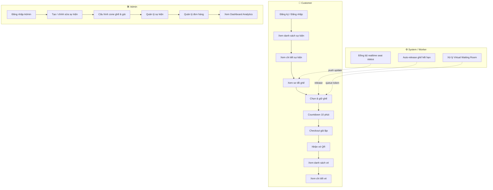
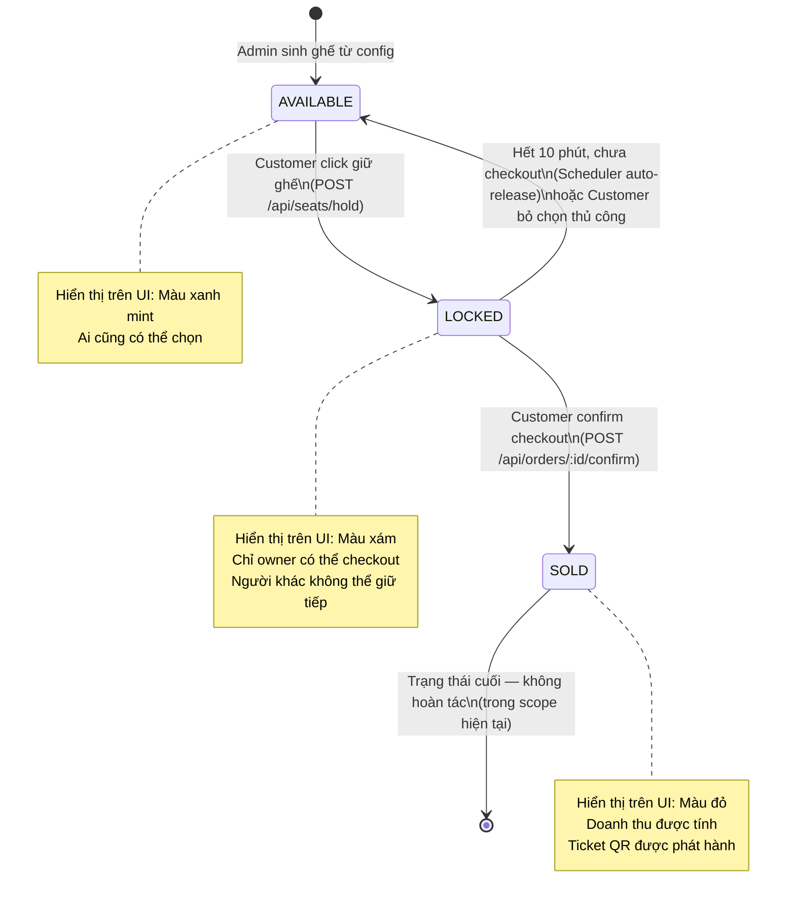

# TicketRush — User Flows & Business Analysis

> **Nguồn sự thật:** Tài liệu này được tổng hợp từ file "Phân tích chi tiết.docx" và cấu trúc project hiện tại.  
> **Phiên bản:** 1.0  
> **Stack:** Spring Boot 4.0.5 / Java 21 / PostgreSQL (backend) · React 19 / Vite 8 / TailwindCSS 4 (frontend)

---

## 1. Tổng quan hệ thống

### 1.1 Mục tiêu hệ thống

TicketRush là nền tảng bán vé sự kiện trực tuyến, giải quyết bài toán **quản lý tồn kho ghế theo thời gian thực dưới tải rất cao** — nơi hàng ngàn người có thể cùng tranh giành một số lượng vé hữu hạn trong thời gian ngắn.

Nghiệp vụ trung tâm:

```
Event → Seat Inventory → Hold/Lock → Checkout → Ticket Issuance → Dashboard/Analytics
```

### 1.2 Phạm vi hệ thống

> **⚠️ Đây là nền tảng single-organizer (internal platform), KHÔNG phải marketplace nhiều ban tổ chức.**

Hệ thống do chính đơn vị tổ chức sự kiện tự xây dựng và vận hành. Không có luồng đăng ký nhà tổ chức, không có multi-tenant.

### 1.3 Các vai trò chính

| Vai trò | Mô tả | Quyền hạn |
|---|---|---|
| **Customer** | Khán giả / người mua vé | Đăng ký, đăng nhập, xem sự kiện, chọn ghế, giữ ghế, checkout, xem vé |
| **Admin** | Chủ hệ thống / Ban tổ chức | Toàn quyền: tạo/sửa sự kiện, cấu hình ghế, xem dashboard, quản lý đơn hàng |
| **System / Worker** | Actor ngầm định (Scheduler / WebSocket) | Tự động release ghế hết hạn, đồng bộ trạng thái ghế realtime, điều phối virtual queue |

---

## 2. Use Case Tổng Quát



---

## 3. User Flows Chi Tiết

---

### Flow A — Customer Authentication Flow

#### A.1 Đăng ký tài khoản

- **Actor:** Khách vãng lai (Guest)
- **Mục tiêu:** Tạo tài khoản Customer để mua vé
- **Điều kiện bắt đầu:** Người dùng chưa có tài khoản, truy cập trang SignUp
- **Điều kiện kết thúc thành công:** Tài khoản được tạo, user được đăng nhập tự động và redirect về Homepage

**Main flow:**
1. User truy cập `/signup`
2. Nhập: Họ tên đầy đủ, Email, Số điện thoại, Mật khẩu, Xác nhận mật khẩu, Ngày sinh *(required — phục vụ analytics)*, Giới tính *(required — phục vụ analytics)*
3. Submit form → `POST /api/auth/register`
4. Backend validate: email chưa tồn tại, password khớp, format hợp lệ
5. Hash password (BCrypt), lưu DB với `role = CUSTOMER`
6. Trả về JWT token + user info
7. Frontend lưu token vào localStorage, set AuthContext
8. Redirect về `/` (Homepage)

**Alternative flows:**
- A.1a: Email đã tồn tại → hiển thị lỗi "Email đã được sử dụng"
- A.1b: Password không khớp → validate inline trước khi submit

**Error cases:**
- Network error → toast "Lỗi kết nối, vui lòng thử lại"
- Server 500 → toast "Đã có lỗi xảy ra"

**Màn hình frontend:** `SignUp`  
**API:** `POST /api/auth/register`  
**Business rules:** BR-01, BR-09

---

#### A.2 Đăng nhập

- **Actor:** Customer đã có tài khoản
- **Mục tiêu:** Xác thực và nhận JWT token
- **Điều kiện bắt đầu:** User truy cập `/login` hoặc bị redirect từ protected route
- **Điều kiện kết thúc thành công:** User được đăng nhập, redirect về trang trước đó hoặc Homepage

**Main flow:**
1. User nhập Email + Mật khẩu
2. Submit → `POST /api/auth/login`
3. Backend xác thực credentials, kiểm tra role
4. Trả về JWT token + `{ id, fullName, email, role }`
5. Frontend lưu token, set AuthContext
6. Redirect: nếu có `returnUrl` thì về đó, không thì về `/`

**Alternative flows:**
- A.2a: Admin login → redirect về `/admin/dashboard` thay vì `/`

**Error cases:**
- Sai email/password → "Email hoặc mật khẩu không đúng" (không tiết lộ field nào sai)
- Tài khoản bị khóa (scope tương lai) → thông báo phù hợp

**Màn hình frontend:** `SignIn`  
**API:** `POST /api/auth/login`  
**Business rules:** BR-01

---

#### A.3 Truy cập màn hình yêu cầu đăng nhập

- **Actor:** Guest
- **Mục tiêu:** Bảo vệ protected routes
- **Điều kiện bắt đầu:** Guest cố truy cập `/seat-selection`, `/checkout`, `/my-tickets`, `/admin/*`

**Main flow:**
1. `ProtectedRoute` component kiểm tra JWT trong AuthContext
2. JWT không có hoặc expired → redirect về `/login?returnUrl=<current_path>`
3. Sau khi login thành công → redirect về `returnUrl`

**Màn hình frontend:** `SignIn`  
**Business rules:** BR-01

---

### Flow B — Event Discovery Flow

#### B.1 Xem Homepage & danh sách sự kiện

- **Actor:** Customer (đã hoặc chưa đăng nhập)
- **Mục tiêu:** Khám phá sự kiện đang mở bán
- **Điều kiện bắt đầu:** User truy cập `/`

**Main flow:**
1. Frontend gọi `GET /api/events?status=ON_SALE&page=0&size=12`
2. Hiển thị Hero banner + danh sách Event Cards
3. Mỗi card hiển thị: ảnh, tên sự kiện, ngày giờ, địa điểm, giá từ, badge trạng thái
4. User có thể tìm kiếm theo tên sự kiện (client-side hoặc `GET /api/events?search=keyword`)
5. Click card → navigate `/events/:id`

**Alternative flows:**
- B.1a: Không có sự kiện nào → hiển thị empty state "Chưa có sự kiện nào"

**Màn hình frontend:** `Homepage`  
**API:** `GET /api/events`  
**Business rules:** BR-10

---

#### B.2 Xem chi tiết sự kiện

- **Actor:** Customer (đã hoặc chưa đăng nhập)
- **Mục tiêu:** Xem đầy đủ thông tin sự kiện, nghệ sĩ, địa điểm, giá vé trước khi mua
- **Điều kiện bắt đầu:** User ở trang `/events/:id`

**Main flow:**
1. `GET /api/events/:id` → load thông tin sự kiện
2. `GET /api/seats/event/:id/summary` → load tổng quan ghế theo zone (available count, price)
3. Hiển thị: banner, mô tả, nghệ sĩ, địa điểm, giá theo khu
4. CTA "Chọn ghế" → nếu chưa login thì redirect `/login?returnUrl=/events/:id`, nếu đã login thì kiểm tra virtual queue

**Alternative flows:**
- B.2a: Sự kiện `UPCOMING` → ẩn nút "Chọn ghế", hiện "Chưa mở bán"
- B.2b: Sự kiện `ENDED` / `CANCELLED` → hiện trạng thái phù hợp, ẩn CTA

**Màn hình frontend:** `EventDetails`  
**API:** `GET /api/events/:id`, `GET /api/seats/event/:id/summary`  
**Business rules:** BR-10

---

### Flow C — Seat Selection & Hold Flow

#### C.1 Load seat map

- **Actor:** Customer (đã đăng nhập, đã qua queue nếu cần)
- **Mục tiêu:** Hiển thị sơ đồ ghế realtime
- **Điều kiện bắt đầu:** User ở `/events/:id/seats`, có valid JWT

**Main flow:**
1. `GET /api/seats/event/:id` → load toàn bộ ghế với trạng thái hiện tại
2. Render seat map: mỗi ghế hiển thị màu theo status (available=xanh, locked=xám, sold=đỏ)
3. Frontend subscribe WebSocket topic `/topic/seats/:eventId` để nhận cập nhật realtime
4. Khi có event WebSocket → cập nhật ghế tương ứng trên map mà không reload trang

**Màn hình frontend:** `SeatSelection`  
**API:** `GET /api/seats/event/:id`  
**WebSocket:** `SUBSCRIBE /topic/seats/:eventId`  
**Business rules:** BR-03, BR-08

---

#### C.2 Chọn và giữ ghế

- **Actor:** Customer
- **Mục tiêu:** Hold ghế thành công, bắt đầu countdown 10 phút
- **Điều kiện bắt đầu:** Seat map đã load, user click vào ghế available

**Main flow:**
1. User click ghế có status `AVAILABLE`
2. Frontend kiểm tra số ghế đang giữ (≤ 2)
3. Gọi `POST /api/seats/hold` với `{ seatId, eventId }`
4. Backend thực hiện trong DB transaction:
   - `SELECT ... FOR UPDATE` ghế đó
   - Kiểm tra status vẫn là `AVAILABLE`
   - Nếu OK: cập nhật status → `LOCKED`, ghi `held_by = userId`, `held_until = now() + 10min`
   - Trả về `{ seatId, heldUntil, remainingSeconds: 600 }`
5. Frontend:
   - Đổi màu ghế → xám/locked
   - Thêm ghế vào danh sách "ghế đang giữ"
   - Khởi động countdown 10 phút
6. Backend broadcast WebSocket message tới `/topic/seats/:eventId`: `{ seatId, status: "LOCKED" }`
7. Các user khác đang xem seat map cập nhật ghế đó → màu locked

**Alternative flows:**
- C.2a: Ghế đã bị người khác giữ trước đó (race condition)
  - Backend trả `409 Conflict` → Frontend toast "Ghế này vừa được người khác giữ" → không đổi màu
- C.2b: User đang giữ 2 ghế → Frontend chặn không cho gọi API thêm, toast "Tối đa 2 ghế mỗi lần"

**Error cases:**
- User chưa đăng nhập → redirect `/login`
- Hold thất bại do lỗi server → toast lỗi, ghế không đổi màu

**Màn hình frontend:** `SeatSelection`  
**API:** `POST /api/seats/hold`  
**WebSocket:** `PUBLISH /topic/seats/:eventId`  
**Business rules:** BR-02, BR-03, BR-04, BR-08

---

#### C.3 Bỏ chọn ghế / Release ghế thủ công

- **Actor:** Customer
- **Mục tiêu:** Trả ghế về available khi user chủ động bỏ chọn

**Main flow:**
1. User click vào ghế đang locked (ghế của mình)
2. Frontend gọi `DELETE /api/seats/:seatId/release`
3. Backend: xóa hold record, cập nhật status → `AVAILABLE`
4. Broadcast WebSocket: `{ seatId, status: "AVAILABLE" }`
5. Frontend xóa ghế khỏi danh sách giữ, reset countdown nếu không còn ghế nào

**Màn hình frontend:** `SeatSelection`  
**API:** `DELETE /api/seats/:seatId/release`  
**Business rules:** BR-04

---

#### C.4 Auto-release khi hết countdown

- **Actor:** System (Scheduler)
- **Mục tiêu:** Release ghế không được thanh toán trong 10 phút

**Main flow:**
1. Scheduler chạy mỗi 30 giây (configurable)
2. Query: `SELECT * FROM event_seats WHERE status = 'LOCKED' AND held_until < NOW()`
3. Với từng ghế hết hạn:
   - Cập nhật status → `AVAILABLE`
   - Xóa `held_by`, `held_until`
4. Broadcast WebSocket: `{ seatId, status: "AVAILABLE" }`
5. Trên UI của user giữ ghế: countdown về 0 → toast "Thời gian giữ ghế đã hết" → disable nút Checkout

**Màn hình frontend:** `SeatSelection` (countdown component)  
**Backend:** `SeatReleaseScheduler.java`  
**Business rules:** BR-04, BR-05

---

### Flow D — Checkout Flow

#### D.1 Xem Order Confirmation

- **Actor:** Customer đang giữ ít nhất 1 ghế
- **Mục tiêu:** Review đơn hàng trước khi xác nhận
- **Điều kiện bắt đầu:** User click "Tiến hành thanh toán" từ SeatSelection, còn hold hợp lệ

**Main flow:**
1. Frontend navigate `/checkout`
2. `GET /api/orders/pending` hoặc lấy từ state: danh sách ghế đang giữ, tổng tiền
3. Hiển thị: thông tin sự kiện, danh sách ghế (zone, hàng, số ghế, đơn giá), tổng cộng, countdown còn lại
4. User kiểm tra thông tin

**Màn hình frontend:** `OrderConfirmation`  
**API:** `POST /api/orders/event/:eventId` (tạo pending order)  
**Business rules:** BR-05, BR-06

---

#### D.2 Xác nhận thanh toán (giả lập)

- **Actor:** Customer
- **Mục tiêu:** Hoàn tất mua vé, nhận ticket QR
- **Điều kiện bắt đầu:** User click "XÁC NHẬN THANH TOÁN", hold còn hiệu lực

**Main flow:**
1. User click "XÁC NHẬN"
2. `POST /api/orders/:orderId/confirm`
3. Backend thực hiện trong transaction:
   - Kiểm tra tất cả ghế trong order vẫn `LOCKED` và `held_by = userId` và `held_until > NOW()`
   - Nếu OK:
     - Cập nhật tất cả ghế → `SOLD`
     - Tạo Order record với status `PAID`
     - Sinh Ticket cho từng ghế (UUID → encode thành QR data)
     - Tính doanh thu (chỉ tính SOLD)
4. Broadcast WebSocket: mỗi ghế `{ seatId, status: "SOLD" }`
5. Frontend redirect → `/booking-success?orderId=xxx`

**Alternative flows:**
- D.2a: Hold đã expired khi confirm → Backend trả `410 Gone` → Frontend toast "Thời gian giữ ghế đã hết, vui lòng chọn lại" → redirect về seat map

**Màn hình frontend:** `OrderConfirmation` → `BookingSuccess`  
**API:** `POST /api/orders/:orderId/confirm`  
**WebSocket:** `PUBLISH /topic/seats/:eventId`  
**Business rules:** BR-05, BR-06, BR-07

---

#### D.3 Booking Success

- **Actor:** Customer (vừa thanh toán thành công)
- **Mục tiêu:** Xác nhận thành công, xem summary đơn hàng

**Main flow:**
1. Hiển thị: thông điệp thành công, mã đơn hàng, danh sách vé, link "Xem vé của tôi"
2. User click "Xem vé" → navigate `/my-tickets`

**Màn hình frontend:** `BookingSuccess`  
**API:** `GET /api/orders/:orderId` (load order detail)

---

### Flow E — My Tickets Flow

#### E.1 Xem danh sách vé

- **Actor:** Customer đã mua vé
- **Mục tiêu:** Xem lịch sử và quản lý vé
- **Điều kiện bắt đầu:** User đã đăng nhập, truy cập `/my-tickets`

**Main flow:**
1. `GET /api/tickets/my` → lấy danh sách tất cả ticket của user
2. Hiển thị dạng card: ảnh sự kiện, tên sự kiện, ngày, zone/hàng/ghế, trạng thái vé
3. Click vào ticket → navigate `/tickets/:ticketId`

**Màn hình frontend:** `MyTickets`  
**API:** `GET /api/tickets/my`

---

#### E.2 Xem chi tiết vé & QR Code

- **Actor:** Customer
- **Mục tiêu:** Xem thông tin đầy đủ và QR code để vào cổng

**Main flow:**
1. `GET /api/tickets/:ticketId` → load chi tiết ticket
2. Hiển thị: tên sự kiện, ngày giờ, địa điểm, zone, hàng, số ghế, mã vé (UUID), QR code image
3. QR code được render từ `qrcode.react` dựa trên ticket UUID/code

**Màn hình frontend:** `TicketDetails`  
**API:** `GET /api/tickets/:ticketId`  
**Business rules:** BR-10 (QR đại diện cho vé cụ thể, không phải ảnh ngẫu nhiên)

---

### Flow F — Admin Event Management Flow

#### F.1 Xem danh sách event

- **Actor:** Admin
- **Mục tiêu:** Quản lý tất cả sự kiện
- **Điều kiện bắt đầu:** Admin đã đăng nhập, truy cập `/admin/events`

**Main flow:**
1. `GET /api/admin/events` → load toàn bộ event (không phân biệt status)
2. Hiển thị dạng bảng: tên, ngày, địa điểm, status badge, số ghế sold/total, actions
3. Filter theo status: ALL / UPCOMING / ON_SALE / ENDED / CANCELLED
4. Actions: Xem chi tiết, Chỉnh sửa, Thay đổi status, Xem seat config

**Màn hình frontend:** `EventManagement`  
**API:** `GET /api/admin/events`

---

#### F.2 Tạo event mới

- **Actor:** Admin
- **Mục tiêu:** Tạo sự kiện mới với đầy đủ thông tin
- **Điều kiện bắt đầu:** Admin click "Tạo sự kiện mới"

**Main flow:**
1. Admin nhập: Tên sự kiện, Mô tả, Địa điểm, Ngày giờ, URL ảnh banner
2. Status mặc định: `UPCOMING`
3. Submit → `POST /api/admin/events`
4. Sau khi tạo → redirect về trang cấu hình seat layout (`/admin/events/:id/seat-config`)

**Error cases:**
- Thiếu trường bắt buộc → inline validation
- Ngày trong quá khứ → cảnh báo

**Màn hình frontend:** `CreateEvent`  
**API:** `POST /api/admin/events`

---

#### F.3 Publish / Thay đổi status event

- **Actor:** Admin
- **Mục tiêu:** Mở bán / đóng bán / hủy sự kiện

**Main flow:**
1. Admin click action "Mở bán" trên event có status `UPCOMING`
2. `PATCH /api/admin/events/:id/status?status=ON_SALE`
3. Confirm dialog → confirm → gọi API
4. Status badge cập nhật ngay

**Status transitions hợp lệ:**
- `UPCOMING` → `ON_SALE` (Publish/Mở bán)
- `ON_SALE` → `ENDED` (Kết thúc)
- `UPCOMING` / `ON_SALE` → `CANCELLED` (Hủy)

**Màn hình frontend:** `EventManagement`  
**API:** `PATCH /api/admin/events/:id/status`

---

### Flow G — Seat Layout Configuration Flow

#### G.1 Cấu hình zone và sinh ghế

- **Actor:** Admin
- **Mục tiêu:** Khai báo sơ đồ ghế cho event
- **Điều kiện bắt đầu:** Admin truy cập `/admin/events/:id/seat-config`

**Main flow:**
1. Load event hiện tại, kiểm tra chưa có seat zones (hoặc đang edit)
2. Admin tạo các Zone:
   - Tên zone (VD: "Khu A - VIP", "Khu B - Standard")
   - Số hàng (rows)
   - Số ghế mỗi hàng (seatsPerRow)
   - Giá vé cho zone này (price)
3. Preview seat matrix tự động render dựa trên config
4. Admin có thể thêm nhiều zone
5. Click "Lưu cấu hình" → `POST /api/admin/events/:id/seat-zones` với mảng zones
6. Backend sinh `EventSeat` records từ cấu hình (rows × seatsPerRow × mỗi zone)
7. Tất cả ghế mới sinh có status = `AVAILABLE`

**Alternative flows:**
- G.1a: Event đã có ghế (đang ON_SALE) → cảnh báo "Không thể thay đổi cấu hình khi đang bán"

**Màn hình frontend:** `SeatLayoutConfig`  
**API:** `POST /api/admin/events/:id/seat-zones`, `GET /api/admin/events/:id/seat-zones`  
**Business rules:** BR-11

---

### Flow H — Admin Dashboard Flow

#### H.1 Xem Dashboard Analytics

- **Actor:** Admin
- **Mục tiêu:** Giám sát vận hành sự kiện realtime
- **Điều kiện bắt đầu:** Admin truy cập `/admin/dashboard`

**Main flow:**
1. Admin chọn sự kiện muốn xem
2. `GET /api/admin/dashboard/:eventId` → load tất cả metrics
3. Hiển thị:
   - **Doanh thu:** Tổng tiền từ các ghế `SOLD` (không tính LOCKED)
   - **Fill rate:** `(số ghế SOLD / tổng số ghế) × 100%`
   - **Fill rate theo zone:** breakdown theo từng khu vực
   - **Biểu đồ doanh thu theo thời gian:** (group by giờ/ngày)
   - **Phân tích khán giả theo độ tuổi:** nhóm 18-24, 25-34, 35-44, 45+
   - **Phân tích theo giới tính:** Male / Female / Other
   - **Recent orders:** danh sách đơn hàng mới nhất (realtime polling 5s)
4. Frontend polling `GET /api/admin/dashboard/:eventId` mỗi 5 giây để refresh

**⚠️ Lưu ý nghiệp vụ:** Analytics tuổi/giới tính chỉ chính xác khi Customer đã điền đầy đủ `dateOfBirth` và `gender` lúc đăng ký.

**Màn hình frontend:** `AdminDashboard`  
**API:** `GET /api/admin/dashboard/:eventId`  
**Business rules:** BR-07, BR-09

---

### Flow I — Order Management Flow

#### I.1 Xem & tìm kiếm đơn hàng

- **Actor:** Admin
- **Mục tiêu:** Tra cứu lịch sử giao dịch
- **Điều kiện bắt đầu:** Admin truy cập `/admin/orders`

**Main flow:**
1. `GET /api/admin/orders?page=0&size=20` → load danh sách orders
2. Hiển thị bảng: mã order, khách hàng, sự kiện, số ghế, tổng tiền, thời gian, status
3. Filter: theo status (PENDING / PAID / CANCELLED), theo tên/email khách, theo sự kiện, theo ngày
4. Search: `GET /api/admin/orders?search=keyword`
5. Click vào order → xem chi tiết: danh sách ghế, thông tin khách, lịch sử trạng thái

**Màn hình frontend:** `OrderManagement`  
**API:** `GET /api/admin/orders`, `GET /api/admin/orders/:orderId`

---

### Flow J — Virtual Waiting Room Flow

#### J.1 Luồng hàng chờ ảo

- **Actor:** Customer, System
- **Mục tiêu:** Bảo vệ hệ thống khỏi traffic spike, đảm bảo công bằng
- **Điều kiện bắt đầu:** Event có nhiều người cùng truy cập (trigger condition: số lượng concurrent requests vượt threshold)

**Main flow:**
1. Customer click "Chọn ghế" từ EventDetails
2. Backend `GET /api/queue/status/:eventId` → kiểm tra event có kích hoạt queue không
3. Nếu queue active:
   a. `POST /api/queue/join/:eventId` → nhận `{ position, queueToken, estimatedWait }`
   b. Redirect về `/waiting-room/:eventId`
   c. Hiển thị: vị trí trong hàng đợi, ước tính thời gian chờ, animation
4. Frontend polling `GET /api/queue/position/:queueToken` mỗi 3 giây
5. Khi đến lượt:
   - Backend response: `{ status: "ADMITTED", accessToken: "...", validUntil: "..." }`
   - Frontend nhận → redirect về `/events/:id/seats` với `accessToken` trong header/params
6. Tại SeatSelection: mỗi API call gửi kèm `accessToken`
7. Backend validate `accessToken` trước khi cho phép hold ghế

**Alternative flows:**
- J.1a: Queue không active → redirect thẳng vào seat map không qua waiting room
- J.1b: Queue token hết hạn (user để tab quá lâu) → backend trả 401, frontend redirect về waiting room, join queue lại

**Error cases:**
- User đóng tab trong lúc chờ → mất vị trí (queue token vô hiệu)
- Server restart → queue bị xóa → tất cả user vào lại từ đầu

**Màn hình frontend:** `VirtualWaitingRoom`  
**API:** `POST /api/queue/join/:eventId`, `GET /api/queue/position/:token`  
**Business rules:** BR-12

---

## 4. Business Rules

| ID | Rule | Nguồn |
|---|---|---|
| **BR-01** | Đăng ký / đăng nhập là bắt buộc để giữ ghế, checkout, và xem vé. Guest chỉ được xem thông tin sự kiện. | Doc §6.A |
| **BR-02** | Click giữ ghế là hành động nghiệp vụ thực sự ở backend (DB transaction + row locking), KHÔNG chỉ đổi màu trên UI. Phải dùng `SELECT ... FOR UPDATE` để tránh race condition. | Doc §3.3 |
| **BR-03** | Một ghế tại một event chỉ có thể được giữ/bán cho đúng một user tại một thời điểm. | Doc §4 |
| **BR-04** | Ghế locked có thời hạn 10 phút kể từ thời điểm hold. Hết hạn mà chưa checkout thì ghế tự động về `AVAILABLE`. | Doc §3.3, §4 |
| **BR-05** | Checkout chỉ thành công nếu hold vẫn còn hiệu lực (`held_until > NOW()` và `held_by = userId`). | Doc §3.5 |
| **BR-06** | Khi checkout confirm thành công: ghế chuyển `LOCKED → SOLD`, order chuyển `PENDING → PAID`, ticket được sinh. | Doc §3.5 |
| **BR-07** | Doanh thu trên Dashboard chỉ tính ghế có status `SOLD`. Không tính ghế `LOCKED` (tránh doanh thu ảo). | Doc §3.7, §6.E |
| **BR-08** | Trạng thái ghế phải được đồng bộ realtime cho tất cả user đang xem cùng seat map (qua WebSocket STOMP hoặc polling). | Doc §3.8 |
| **BR-09** | Analytics tuổi/giới tính chỉ chính xác khi Customer đã cung cấp `dateOfBirth` và `gender` trong profile. Hai trường này là bắt buộc khi đăng ký. | Doc §3.7 |
| **BR-10** | Customer được chọn tối đa 2 ghế trong một lượt mua. Backend phải enforce giới hạn này (không chỉ dựa vào UI). | Doc §6.B |
| **BR-11** | Giá vé gắn theo Zone (khu vực), không phải từng ghế riêng lẻ. Khi Admin cấu hình zone, hệ thống tự sinh ma trận ghế theo cấu hình (rows × seatsPerRow). | Doc §3.2 |
| **BR-12** | Khi có virtual queue active: chỉ user có access token hợp lệ mới được phép hold ghế. Token có thời hạn sử dụng. | Doc §3.9 |

---

## 5. Vòng đời trạng thái ghế (Seat Status Lifecycle)



---

## 6. Mapping Màn hình → Flow → API

| Màn hình | Flow | API chính |
|---|---|---|
| `SignIn` | A.2 | `POST /api/auth/login` |
| `SignUp` | A.1 | `POST /api/auth/register` |
| `Homepage` | B.1 | `GET /api/events` |
| `EventDetails` | B.2 | `GET /api/events/:id` |
| `VirtualWaitingRoom` | J.1 | `POST /api/queue/join/:eventId`, `GET /api/queue/position/:token` |
| `SeatSelection` | C.1, C.2, C.3 | `GET /api/seats/event/:id`, `POST /api/seats/hold`, `DELETE /api/seats/:id/release` |
| `OrderConfirmation` | D.1 | `POST /api/orders/event/:eventId` |
| `BookingSuccess` | D.3 | `GET /api/orders/:orderId` |
| `MyTickets` | E.1 | `GET /api/tickets/my` |
| `TicketDetails` | E.2 | `GET /api/tickets/:ticketId` |
| `AdminDashboard` | H.1 | `GET /api/admin/dashboard/:eventId` |
| `EventManagement` | F.1, F.3 | `GET /api/admin/events`, `PATCH /api/admin/events/:id/status` |
| `CreateEvent` | F.2 | `POST /api/admin/events` |
| `SeatLayoutConfig` | G.1 | `POST /api/admin/events/:id/seat-zones` |
| `OrderManagement` | I.1 | `GET /api/admin/orders` |

---

## 7. Ghi chú kỹ thuật từ cấu trúc project hiện tại

### Backend (Spring Boot 4.0.5 / Java 21)
- Package gốc: `com.example.TicketRush_backend`
- Database: PostgreSQL (JDBC URL: `jdbc:postgresql://localhost:5432/ems`)
- JPA: `ddl-auto=update` (sẽ cần chuyển sang `validate` + Flyway/Liquibase sau)
- Dependencies có sẵn: Spring Data JPA, Spring Web MVC, PostgreSQL Driver, Lombok
- **Chưa có:** Spring Security, JWT, WebSocket, Validation — cần thêm vào `pom.xml`

### Frontend (React 19 / Vite 8 / TailwindCSS 4)
- Chưa có routing — cần thêm `react-router-dom`
- Chưa có HTTP client — cần thêm `axios`
- Chưa có WebSocket — cần thêm `@stomp/stompjs` + `sockjs-client`
- Design system: Kinetic Precision (Inter font, primary=#4F46E5 Indigo, secondary=#10B981 Mint Green)

### Quy ước đặt tên (convention nên theo)
- Java: PascalCase cho class, camelCase cho method/field, `_` trong package name (`TicketRush_backend`)
- React: PascalCase cho component files (`SeatSelection.jsx`), camelCase cho functions
- API: REST `/api/{resource}` cho customer, `/api/admin/{resource}` cho admin
- File docs: `kebab-case.md` trong thư mục `docs/`
